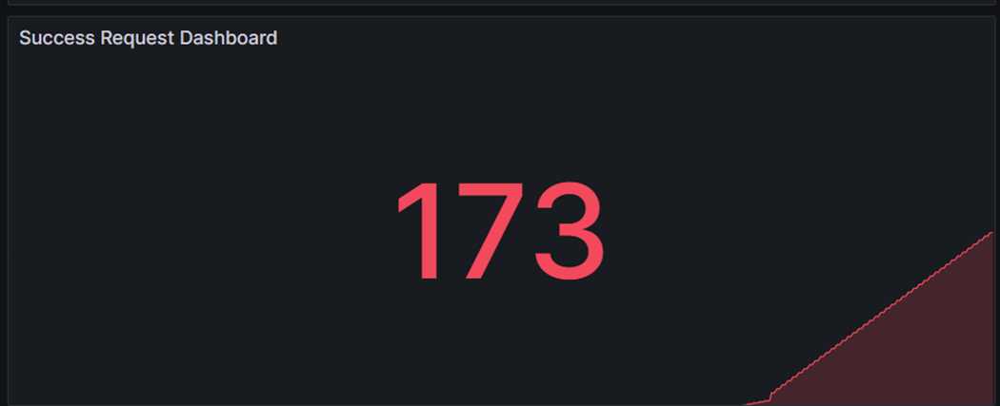

# Agri-Platform: Procurement Service & Cloud-Native Infrastructure

##  Project Overview
This project implements a high-reliability Procurement Service for an Agricultural Platform. It showcases a complete DevOps lifecycle, moving from "hardcoded" deployments to a professional **GitOps** and **Telemetry-driven** architecture.

 **Backend**:  in dart with shelf library
 
**Database**: Postgres, MongoDb 
 
**Containerization**: 	Docker

**Orchestration**: Kubernetes

**CI/CD**:	GitHub Actions

**Package Manager**: Helm

**GitOps**:	ArgoCD

**Monitoring**:	Prometheus, Grafana, Loki


##  Technical Architecture

### CI/CD Pipeline
DevOps implementation of this project I use GitHub actions for cover CI and for CD I use ArgoCD

### GitHub Actions Workflow


### Repository in Docker hub
My project image in docker hub


### Kubernetes implementation

Our project deployed to kubernetes using Helm charts and managed by ArgoCD

####  Helm (Infrastructure as Code)
The project has been refactored from static YAML files into a **Proper Helm Chart** to ensure dynamic, reusable deployments.
* **Dynamic Values,** All environment-specific data (images, ports, paths) is managed via `values.yaml`.
* **Templates,** Utilizes Go-templating in `k8s-deployment.yaml` and `service.yaml` for parameterization.
*  **Database connection** file  of helm template `k8s-databases.yaml`
* 

 
###  Continuous Delivery (GitOps) with ArgoCD
Deployment is fully automated using **Argo CD**.
 Argo CD monitors the GitHub repository and synchronizes the cluster state with the Helm chart.
Any manual changes to the cluster are automatically reverted by the Argo CD controller to maintain the "Source of Truth" in Git.

**Image before sync in argo cd:**


**After sync:**


### Resources of Kubernetes:


##  Monitoring & Dashboards

The **Agri-Backend Daily Report** in Grafana provides critical visualization panels

 General dashboards
 
  CPU/Memory


1. **Total Orders:** (Custom Metric) `sum(agri_orders_created_total)`.
2. **Saga Status:** (Custom Metric) Breakdown of successful vs. failed transactions.
3. **HTTP Success Rate:** Real-time monitoring of 2xx vs 5xx responses.
4. **Request Latency:** Database operation durations.
5. **CPU/Memory:** Resource utilization per pod.
6. **Path Activity:** Identification of most-hit API endpoints.
7. **System Uptime:** Real-time health status.

 



---

##  How to Deploy

1. **Build & Push Image:**
   ```bash
   docker build -t your-repo/agri-backend:latest .
   docker push your-repo/agri-backend:
   
2. **Install via Helm:**
   >helm upgrade --install agri-release ./agri-chart
3. **Verify Metrics: Access the metrics endpoint at:**
> http://localhost:8080/metrics


